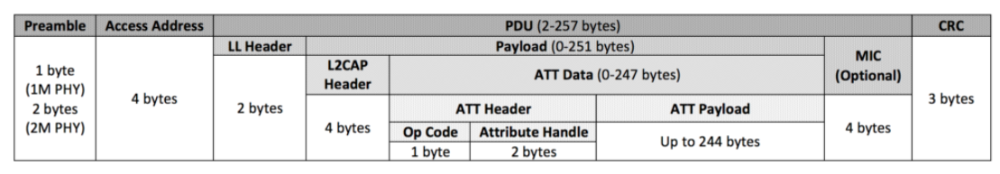

# Bluetooth&reg; LE Throughput Server

This code example demonstrates achieving the maximum throughput using Generic Attribute Profile (GATT) layer notification and GATT write command.

[View this README on GitHub.]

[Provide feedback on this code example.]


## Requirements

- [ModusToolbox&trade;](https://www.infineon.com/modustoolbox) v3.2 or later (tested with v3.2)
- Board support package (BSP) minimum required version: v0.6.0
- Programming language: C
- Associated parts: [CYW955913EVK-01](https://infineon.com/CYW955913EVK-01)


## Supported toolchains (make variable 'TOOLCHAIN')

- GNU Arm&reg; Embedded Compiler v11.3.1 (`GCC_ARM`) – Default value of `TOOLCHAIN`


## Supported kits (make variable 'TARGET')

- [CYW955913EVK-01 Wi-Fi Bluetooth&reg; Prototyping Kit](https://infineon.com/CYW955913EVK-01) (`CYW955913EVK-01`) – Default value of `TARGET`


## Hardware setup

This example uses the kit’s default configuration. See the respective kit guide to ensure that the kit is configured correctly.

Two Bluetooth&reg; LE boards are required to use this code example: a Bluetooth&reg; LE GATT Server throughput measurement and a Bluetooth&reg; LE GATT Client throughput measurement.


## Software setup

See the [ModusToolbox&trade; tools package installation guide](https://www.infineon.com/ModusToolboxInstallguide) for information about installing and configuring the tools package.

Install a terminal emulator if you don't have one. Instructions in this document use [Tera Term](https://teratermproject.github.io/index-en.html).

This example requires no additional software or tools.

Download and install the AIROC&trade; Bluetooth&reg; Connect App for [iOS](https://apps.apple.com/in/app/airoc-bluetooth-connect-app/id6443702288) or [Android](https://play.google.com/store/apps/details?id=com.infineon.airocbluetoothconnect).

Scan the following QR codes on your mobile phone to download the AIROC&trade; Bluetooth&reg; Connect App.

**Figure 1. QR codes to download the AIROC&trade; Bluetooth&reg; Connect App**


> **Note**: If you are using an iOS or Android smartphone as Bluetooth&reg; LE Central, all features of the GATT Server throughput application cannot be used. Throughput can be measured only for GATT notifications. In this case, throughput rates obtained depend on the connection parameters negotiated and the physical layer (PHY) of the central device.

## Using the code example

### Create the project

The ModusToolbox&trade; tools package provides the Project Creator as both a GUI tool and a command line tool.

<details><summary><b>Use Project Creator GUI</b></summary>

1. Open the Project Creator GUI tool.

   There are several ways to do this, including launching it from the dashboard or from inside the Eclipse IDE. For more details, see the [Project Creator user guide](https://www.infineon.com/ModusToolboxProjectCreator) (locally available at *{ModusToolbox&trade; install directory}/tools_{version}/project-creator/docs/project-creator.pdf*).

2. On the **Choose Board Support Package (BSP)** page, select a kit supported by this code example. See [Supported kits](#supported-kits-make-variable-target).

   > **Note:** To use this code example for a kit not listed here, you may need to update the source files. If the kit does not have the required resources, the application may not work.

3. On the **Select Application** page:

   a. Select the **Applications(s) Root Path** and the **Target IDE**.

   > **Note:** Depending on how you open the Project Creator tool, these fields may be pre-selected for you.

   b.	Select this code example from the list by enabling its check box.

   > **Note:** You can narrow the list of displayed examples by typing in the filter box.

   c. (Optional) Change the suggested **New Application Name** and **New BSP Name**.

   d. Click **Create** to complete the application creation process.

</details>

<details><summary><b>Use Project Creator CLI</b></summary>

The 'project-creator-cli' tool can be used to create applications from a CLI terminal or from within batch files or shell scripts. This tool is available in the *{ModusToolbox&trade; install directory}/tools_{version}/project-creator/* directory.

Use a CLI terminal to invoke the 'project-creator-cli' tool. On Windows, use the command-line 'modus-shell' program provided in the ModusToolbox&trade; installation instead of a standard Windows command-line application. This shell provides access to all ModusToolbox&trade; tools. You can access it by typing "modus-shell" in the search box in the Windows menu. In Linux and macOS, you can use any terminal application.

The following example clones the "[mtb-example-btstack-threadx-throughput-server](https://github.com/Infineon/mtb-example-btstack-threadx-throughput-server)" application with the desired name "BleThroughputServer" configured for the *CYW955913EVK-01* BSP into the specified working directory, *C:/mtb_projects*:

   ```
   project-creator-cli --board-id CYW955913EVK-01 --app-id mtb-example-btstack-threadx-throughput-server --user-app-name BleThroughputServer --target-dir "C:/mtb_projects"
   ```


The 'project-creator-cli' tool has the following arguments:

Argument | Description | Required/optional
---------|-------------|-----------
`--board-id` | Defined in the <id> field of the [BSP](https://github.com/Infineon?q=bsp-manifest&type=&language=&sort=) manifest | Required
`--app-id`   | Defined in the <id> field of the [CE](https://github.com/Infineon?q=ce-manifest&type=&language=&sort=) manifest | Required
`--target-dir`| Specify the directory in which the application is to be created if you prefer not to use the default current working directory | Optional
`--user-app-name`| Specify the name of the application if you prefer to have a name other than the example's default name | Optional

<br>

> **Note:** The project-creator-cli tool uses the `git clone` and `make getlibs` commands to fetch the repository and import the required libraries. For details, see the "Project creator tools" section of the [ModusToolbox&trade; tools package user guide](https://www.infineon.com/ModusToolboxUserGuide) (locally available at {ModusToolbox&trade; install directory}/docs_{version}/mtb_user_guide.pdf).

</details>

### Open the project

After the project has been created, you can open it in your preferred development environment.


<details><summary><b>Eclipse IDE</b></summary>

If you opened the Project Creator tool from the included Eclipse IDE, the project will open in Eclipse automatically.

For more details, see the [Eclipse IDE for ModusToolbox&trade; user guide](https://www.infineon.com/MTBEclipseIDEUserGuide) (locally available at *{ModusToolbox&trade; install directory}/docs_{version}/mt_ide_user_guide.pdf*).

</details>


<details><summary><b>Visual Studio (VS) Code</b></summary>

Launch VS Code manually, and then open the generated *{project-name}.code-workspace* file located in the project directory.

For more details, see the [Visual Studio Code for ModusToolbox&trade; user guide](https://www.infineon.com/MTBVSCodeUserGuide) (locally available at *{ModusToolbox&trade; install directory}/docs_{version}/mt_vscode_user_guide.pdf*).

</details>


<details><summary><b>Command line</b></summary>

If you prefer to use the CLI, open the appropriate terminal, and navigate to the project directory. On Windows, use the command-line 'modus-shell' program; on Linux and macOS, you can use any terminal application. From there, you can run various `make` commands.

For more details, see the [ModusToolbox&trade; tools package user guide](https://www.infineon.com/ModusToolboxUserGuide) (locally available at *{ModusToolbox&trade; install directory}/docs_{version}/mtb_user_guide.pdf*).

</details>


## Operation

1. Connect the board to your PC using the provided USB cable through the KitProg3 USB connector.

2. Open a terminal program and select the KitProg3 COM port. Set the serial port using the following parameters:

   Baud rate: 115200 bps; Data: 8 bits; Parity: None; stop: 1 bit; Flow control: None; 

3. Program the board using one of the following:

   <details><summary><b>Using Eclipse IDE</b></summary>

      1. Select the application project in the Project Explorer.

      2. In the **Quick Panel**, scroll down, and click **\<Application Name> Program**.
   </details>


   <details><summary><b>Using CLI</b></summary>

     From the terminal, execute the `make program` command to build and program the application using the default toolchain to the default target. The default toolchain is specified in the application's Makefile but you can override this value manually:
      ```
      make program TOOLCHAIN=<toolchain>
      ```

      Example:
      ```
      make program TOOLCHAIN=GCC_ARM
      ```
   </details>

4. Unplug the board and then connect the second board to your PC using the provided cable. Follow **Steps 2** and **3** again to program the second board with the **GATT_client** application.

5. Reset the boards. For [CYW955913EVK-01](https://infineon.com/CYW955913EVK-01), you will need to reset the kit for application to boot.

6. Connect the first board (programmed with **GATT_server**) to your PC and open its terminal to view the UART messages.

7. Press the user button on your GATT Client device to start. The client checks for peer devices with the name **TPUT**. If it finds a device with this name, it initiates the connection. Therefore, after pressing the button, the kits will be auto-connected.

8. Press the user button on the Bluetooth&reg; LE GATT Client device. GATT notifications are enabled. The Bluetooth&reg; LE GATT Server starts sending the GATT notifications of 244 bytes. Throughput is calculated for every second and is displayed on the terminal.
   In this case, the Bluetooth&reg; LE GATT Server calculates the Tx throughput, while the Bluetooth&reg; LE GATT Client calculates the Rx throughput.

9. Press the user button on the Bluetooth&reg; LE GATT Client device. GATT notifications are disabled and GATT write is enabled. The Bluetooth&reg; LE GATT Client starts sending the GATT write of 244 bytes. Throughput is calculated for every second and is displayed on the terminal.
   In this case, the Bluetooth&reg; LE GATT Server calculates the Rx throughput, while the Bluetooth&reg; LE GATT Client calculates the Tx throughput.

10. Press the user button again. GATT notifications are enabled and GATT write stays enabled. The Bluetooth&reg; LE GATT Client starts sending the GATT write of 244 bytes and The Bluetooth&reg; LE GATT Server starts sending the GATT notification of 244 bytes. Throughput is calculated for every second and is displayed on the terminal.
   In this case, the Bluetooth&reg; LE GATT Server calculates the Rx and Tx  throughput, while the Bluetooth&reg; LE GATT Client calculates the Tx and Rx throughput.

11. Consecutive button presses change the mode of data transfer as mentioned in **Steps 7**, **8**, and **9**.

12. If a disconnection occurs, the GATT Server device starts advertising again.

13. To test using the AIROC&trade; Bluetooth&reg; Connect mobile app:

      1. Connect the board to your PC using the provided cable.

      2. Open a terminal program and select the KitProg3 COM port. Set the serial port parameters to 8N1 and 115200 baud.

      3. Program the board with the Bluetooth&reg; LE GATT Server Throughput application.

      4. Turn on Bluetooth&reg; on your Android or iOS device and launch the AIROC&trade; Bluetooth&reg; Connect App.

      5. Swipe down on the AIROC&trade; Bluetooth&reg; Connect App home screen to start scanning for Bluetooth&reg; LE peripherals; your device appears in the AIROC&trade; Bluetooth&reg; Connect App home screen with the name **TPUT**. Select your device to establish the Bluetooth&reg; LE connection.

      6. Select **GATT DB** from the carousel view.  Swipe left or right to change the carousel selections.

      7. Select **Unknown Service** and then select the characteristic with the **Notify** property.

      8. Select **Notify**.

      The device starts sending GATT notifications to the smartphone.

      The Tx GATT throughput values (in kbps) is displayed on the UART terminal.

## Debugging

For Bluetooth HCI logs set ENABLE_SPY_TRACES = 1 in the makefile. You can use [BTSPY](https://github.com/Infineon/btsdk-utils) utility to view the SPY logs and debug protocol related issues. Add airoc-hci-transport from library manager before enabling spy traces, check airoc-hci-transport [README.md](https://github.com/Infineon/airoc-hci-transport/blob/master/README.md) for more details.

</details>

## Design and implementation

### GATT throughput measurement

In this code example, Bluetooth&reg; LE throughput is measured using GATT data sent or received by the application. The application accumulates the number of data packets sent or received and calculates the throughput each second.

GATT throughput = ( number of bytes sent or received in 1 second * 8 bits ) bps

Or

GATT throughput = ( number of bytes sent or received in 1 second * 8 bits )/1000 kbps

While calculating the throughput, consider only GATT data bytes. All the header bytes appended to GATT data must not be considered. The data flow through LE protocol layers and headers being appended in each layer is shown in **Figure 2**.

**Figure 2. GATT data flow**


To achieve the maximum throughput:

- PHY is set to 2M.
- ATT MTU is set to 247.
- Data length extension (DLE) is used.
- The GATT data is 244 bytes.

#### Factors influencing throughput

Some of the factors that affect data throughput are as follows:

- **PHY**

    The PHY rate used will have a direct impact on the maximum data throughput. You can select either 1-Mbps or 2-Mbps PHY. In this code example, PHY is set to 2M after connection. If the Bluetooth&reg; LE central device does not support 2M PHY, the value falls back to 1M. The PHY selected is printed on the UART terminal.

- **Connection interval**

    Bluetooth&reg; LE connection interval is the time between two data transfer events between the central and the peripheral device (in other words, how often the devices communicate). It ranges from 7.5 ms to 4 s (with increments of 1.25 ms). In a connection interval, there may be only one Tx/Rx pair or, if the protocol data unit (PDU) has the more data (MD) flag set, multiple packets may be sent in the same interval.

    A connection event is the time duration within the connection interval where there is actual Tx/Rx activity happening. The connection event is always less than the connection interval. A connection event ends 1 inter frame space (IFS) before the connection interval. Therefore, the connection interval value chosen will impact the throughput.

    A Bluetooth&reg; LE connection is established with the connection interval value set by the central device. However, the peripheral may request a different value. The central device makes the final decision and chooses a value that may be different from, but closer to, the requested value. 

    The connection interval differs between iOS and Android. It also changes depending on the OS version running on the device. This is because the Bluetooth&reg; LE radio may have to attend to other events from the OS and the number of packets sent per connection event may not reach the maximum possible by the Bluetooth&reg; LE stack.

- **ATT MTU**

    The minimum attribute protocol (ATT) maximum transmission unit (MTU) allowed is 23 bytes. This allows a maximum of 20 bytes of ATT payload (3 bytes are used for the ATT header and 4 bytes for the L2CAP header). There is no limit on the maximum MTU value.

    If the ATT MTU is exactly 247 bytes, 244 bytes of ATT data will fit into a single packet. If the MTU is greater than 247 bytes, the MTU will span multiple packets causing the throughput to go down because of an increase in packet overhead and timing in between packets. Therefore, the GATT data size chosen in the application is 244 bytes.

- **DLE**

    The DLE feature is introduced in v4.2 of the Bluetooth&reg; specification. DLE allows the link layer packet to hold a larger payload of up to 251 bytes as shown in **Figure 3**. This means that for one Tx/Rx pair, 244 bytes of GATT data can be sent or received with DLE enabled. If the GATT data is larger than 244 bytes, it is split, and takes multiple LL packets to be transmitted. This introduces header bytes for every chunk of data and therefore lower throughput. Older versions of Bluetooth&reg; LE can support a maximum payload of 27 bytes.


- **Packet Overhead**

    The LE packet includes many packet header bytes which get added up in each layer that are not accounted for in the application data throughput. To minimize the packet overhead, try to configure the ATT MTU size in such a way that the ATT payload data will always fit in a single LE packet. In this code example, the ATT MTU size used is 247 bytes, which exactly matches the ATT payload data size of 244 bytes as shown in **Figure 3**.

    **Figure 3. LE packet format**

    

   

### Resources and settings

**Table 1. Application resources**

Resource  |  Alias/object     |    Purpose     
:------- | :------------    | :------------ 
UART (HAL)|cy_retarget_io_uart_obj| UART HAL object used by Retarget-IO for Debug UART port

This section explains the ModusToolbox&trade; resources and their configurations as used in this code example. Note that all the configurations explained in this section have already been done in the code example.

- **Device Configurator:** ModusToolbox&trade; stores the configuration settings of the application in the *design.modus* file. This file is used by the Device Configurator, which generates the configuration firmware. This firmware is stored in the application’s *GeneratedSource* folder.

   By default, all applications in a workspace share the same *design.modus* file - i.e., they share the same pin configuration. Each BSP has a default *design.modus* file in the *mtb_shared\TARGET_<bsp name>\<version>\COMPONENT_BSP_DESIGN_MODUS* directory. It is not recommended to modify the configuration of a standard BSP directly.

   To modify the configuration for a single application or to create a custom BSP, see the [ModusToolbox&trade; user guide](https://www.infineon.com/ModusToolboxUserGuide). This example uses the default configuration. See [Device Configurator guide](https://www.infineon.com/ModusToolboxDeviceConfig).

- **Bluetooth&reg; Configurator:** The Bluetooth&reg; peripheral has an additional configurator called the 'Bluetooth&reg; Configurator' that is used to generate the Bluetooth&reg; LE GATT database and various Bluetooth&reg; settings for the application. These settings are stored in the file named *design.cybt*.

   > **Note:** Unlike the Device Configurator, the Bluetooth&reg; Configurator settings and files are local to each respective application. The services and characteristics added are explained in the [Design and implementation](#design-and-implementation) section. See [Bluetooth&reg; Configurator guide](https://www.infineon.com/ModusToolboxBLEConfig).


<br>

**Bluetooth&reg; LE GATT Server throughput measurement**

In this code example, the kit acts as a Bluetooth&reg; LE GAP Peripheral and GATT Server. When the kit is powered up, the Bluetooth&reg; LE stack is initialized along with the Bluetooth&reg; porting layer for the respective device.

In the application, there is a task that calculates the throughput every second based on the number of packets successfully sent or received. A HAL timer is configured for 1 millisecond. A task to send notifications is notified through this timer callback every millisecond. The task sends a notification packet and updates the Tx packet count if it is successfully sent. Use a millisecond timer to send out as many packets as possible to achieve maximum throughput.

A connection is established when any client device sends a connection request. After connection, PHY is set to 2M and a request to update the connection interval is sent to GATT Client. The PHY selected and new connection interval values are displayed on the terminal.

The GATT Server has a custom service called 'throughput measurement'. This service has two characteristics called **Notify** and **WriteMe**. The notify characteristic has a client characteristic configuration descriptor (CCCD).

**Figure 4. Throughput measurement custom service**


The flowchart for the application is shown in **Figure 5**.

**Figure 5. Bluetooth&reg; LE GATT Server application flow**


**Notify characteristic:** This characteristic is used to send GATT notifications and has a length of 244 bytes. The bytes sent are used to calculate the Tx throughput.
- When the GATT Client writes the value '1' into the CCCD, notifications are enabled, and the GATT Server starts sending notification packets that have 244 bytes of data. Notifications are sent every millisecond. A millisecond timer is configured and used for this purpose.
- When the GATT Client writes the value '0' into the CCCD, notifications are disabled, and the GATT Server stops sending notifications.

**WriteMe characteristic:** This characteristic is used to receive GATT writes from the GATT Client device and has a length of 244 bytes. The bytes received are used to calculate the Rx throughput.

**Note:** iOS devices limits the number packets sent in a single connection event to five,thus affecting the througput. By keeping the connection event shorter can help in achieving better throuhgput rate. Prefered connection interval for the iOS devices are 15ms.

## Related resources

Resources  | Links
-----------|----------------------------------
Code examples  | [Using ModusToolbox&trade;](https://github.com/Infineon/Code-Examples-for-ModusToolbox-Software) on GitHub
Development kits | Select your kits from the [Evaluation board finder](https://www.infineon.com/cms/en/design-support/finder-selection-tools/product-finder/evaluation-board)
Libraries on GitHub  | [mtb-pdl-cat5](https://github.com/Infineon/mtb-pdl-cat5) – Peripheral Driver Library (PDL) <br> [mtb-hal-cat5](https://github.com/Infineon/mtb-hal-cat5) – Hardware Abstraction Layer (HAL) library <br> [retarget-io](https://github.com/Infineon/retarget-io) – Utility library to retarget STDIO messages to a UART port <br>
Tools  | [ModusToolbox&trade;](https://www.infineon.com/modustoolbox) – ModusToolbox&trade; software is a collection of easy-to-use libraries and tools enabling rapid development with Infineon MCUs for applications ranging from wireless and cloud-connected systems, edge AI/ML, embedded sense and control, to wired USB connectivity using PSoC&trade; Industrial/IoT MCUs, AIROC&trade; Wi-Fi and Bluetooth&reg; connectivity devices, XMC&trade; Industrial MCUs, and EZ-USB&trade;/EZ-PD&trade; wired connectivity controllers. ModusToolbox&trade; incorporates a comprehensive set of BSPs, HAL, libraries, configuration tools, and provides support for industry-standard IDEs to fast-track your embedded application development.

<br>


## Other resources

Infineon provides a wealth of data at [www.infineon.com](https://www.infineon.com) to help you select the right device, and quickly and effectively integrate it into your design.


## Document history

Document title: *CE239640* - *Bluetooth&reg; LE Throughput Server*

Version | Description of change 
------- | ---------------------
1.0.0   | New code example      

<br>

All referenced product or service names and trademarks are the property of their respective owners.

The Bluetooth® word mark and logos are registered trademarks owned by Bluetooth SIG, Inc., and any use of such marks by Infineon is under license.

---------------------------------------------------------

© Cypress Semiconductor Corporation, 2024. This document is the property of Cypress Semiconductor Corporation, an Infineon Technologies company, and its affiliates ("Cypress").  This document, including any software or firmware included or referenced in this document ("Software"), is owned by Cypress under the intellectual property laws and treaties of the United States and other countries worldwide.  Cypress reserves all rights under such laws and treaties and does not, except as specifically stated in this paragraph, grant any license under its patents, copyrights, trademarks, or other intellectual property rights.  If the Software is not accompanied by a license agreement and you do not otherwise have a written agreement with Cypress governing the use of the Software, then Cypress hereby grants you a personal, non-exclusive, nontransferable license (without the right to sublicense) (1) under its copyright rights in the Software (a) for Software provided in source code form, to modify and reproduce the Software solely for use with Cypress hardware products, only internally within your organization, and (b) to distribute the Software in binary code form externally to end users (either directly or indirectly through resellers and distributors), solely for use on Cypress hardware product units, and (2) under those claims of Cypress's patents that are infringed by the Software (as provided by Cypress, unmodified) to make, use, distribute, and import the Software solely for use with Cypress hardware products.  Any other use, reproduction, modification, translation, or compilation of the Software is prohibited.
<br>
TO THE EXTENT PERMITTED BY APPLICABLE LAW, CYPRESS MAKES NO WARRANTY OF ANY KIND, EXPRESS OR IMPLIED, WITH REGARD TO THIS DOCUMENT OR ANY SOFTWARE OR ACCOMPANYING HARDWARE, INCLUDING, BUT NOT LIMITED TO, THE IMPLIED WARRANTIES OF MERCHANTABILITY AND FITNESS FOR A PARTICULAR PURPOSE.  No computing device can be absolutely secure.  Therefore, despite security measures implemented in Cypress hardware or software products, Cypress shall have no liability arising out of any security breach, such as unauthorized access to or use of a Cypress product. CYPRESS DOES NOT REPRESENT, WARRANT, OR GUARANTEE THAT CYPRESS PRODUCTS, OR SYSTEMS CREATED USING CYPRESS PRODUCTS, WILL BE FREE FROM CORRUPTION, ATTACK, VIRUSES, INTERFERENCE, HACKING, DATA LOSS OR THEFT, OR OTHER SECURITY INTRUSION (collectively, "Security Breach").  Cypress disclaims any liability relating to any Security Breach, and you shall and hereby do release Cypress from any claim, damage, or other liability arising from any Security Breach.  In addition, the products described in these materials may contain design defects or errors known as errata which may cause the product to deviate from published specifications. To the extent permitted by applicable law, Cypress reserves the right to make changes to this document without further notice. Cypress does not assume any liability arising out of the application or use of any product or circuit described in this document. Any information provided in this document, including any sample design information or programming code, is provided only for reference purposes.  It is the responsibility of the user of this document to properly design, program, and test the functionality and safety of any application made of this information and any resulting product.  "High-Risk Device" means any device or system whose failure could cause personal injury, death, or property damage.  Examples of High-Risk Devices are weapons, nuclear installations, surgical implants, and other medical devices.  "Critical Component" means any component of a High-Risk Device whose failure to perform can be reasonably expected to cause, directly or indirectly, the failure of the High-Risk Device, or to affect its safety or effectiveness.  Cypress is not liable, in whole or in part, and you shall and hereby do release Cypress from any claim, damage, or other liability arising from any use of a Cypress product as a Critical Component in a High-Risk Device. You shall indemnify and hold Cypress, including its affiliates, and its directors, officers, employees, agents, distributors, and assigns harmless from and against all claims, costs, damages, and expenses, arising out of any claim, including claims for product liability, personal injury or death, or property damage arising from any use of a Cypress product as a Critical Component in a High-Risk Device. Cypress products are not intended or authorized for use as a Critical Component in any High-Risk Device except to the limited extent that (i) Cypress's published data sheet for the product explicitly states Cypress has qualified the product for use in a specific High-Risk Device, or (ii) Cypress has given you advance written authorization to use the product as a Critical Component in the specific High-Risk Device and you have signed a separate indemnification agreement.
<br>
Cypress, the Cypress logo, and combinations thereof, ModusToolbox, PSoC, CAPSENSE, EZ-USB, F-RAM, and TRAVEO are trademarks or registered trademarks of Cypress or a subsidiary of Cypress in the United States or in other countries. For a more complete list of Cypress trademarks, visit [www.infineon.com](https://www.infineon.com). Other names and brands may be claimed as property of their respective owners.
